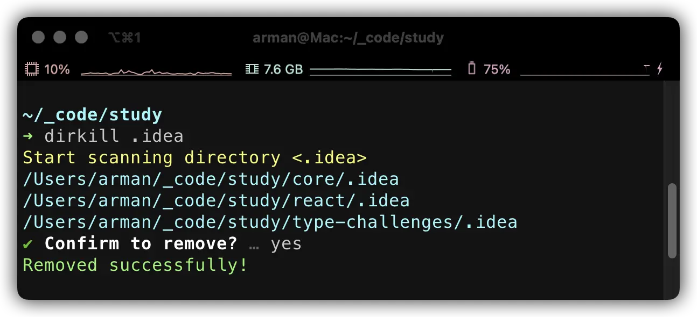

<div align="center">

<h1>dirkill</h1>

dirkill is a CLI tool to remove directories by name recursively under the current directory.



</div>

## Installation

```
npm i -g dirkill
```

## Usage

dirkill will list all matched directories under the current directory and ask for confirmation before deleting.

```bash
dirkill dir_name
```

## Options

### `-s`, `--skip`

Specify the directories to skip. It's helpful to improve performance and the default value is "node_modules".

```bash
dirkill dir_name -s node_modules,dist
```
