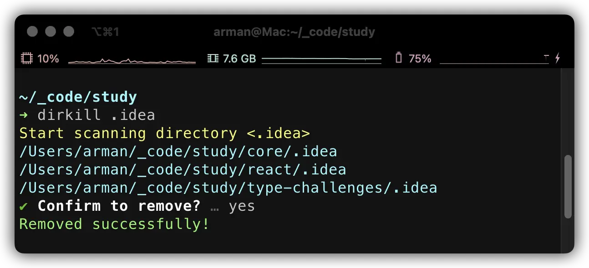

<div align="center">

<h1>dirkill</h1>

一个命令行工具，可以递归删除当前目录下所有名称匹配的目录。



</div>


## 安装

```
npm i -g dirkill
```

## 快速开始

dirkill 会列出当前目录下所有目录名匹配的路径，确认后即可删除。

```bash
dirkill dir_name
```

## 选项

### `-s`, `--skip`

跳过指定目录，跳过大型文件目录可以提升性能，默认值是 "node_modules"。

```bash
dirkill dir_name -s node_modules,dist
```
